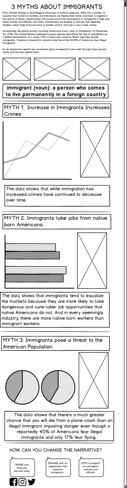
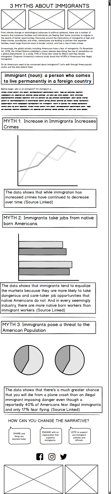

The following is my creative process for wireframing and testing the clarity of my design with potential users. 

**Target Audience:** The targeted audience are the majority of Americans who have apprehensions or questions about how immigrants affect the economic and social status of the nation. 

**User Testing Outreach:** Seeking individuals at different ages and lifestyles to be able to seek their perspective on understanding the design at hand. 

**GOALS + QUESTIONS**
Make people interested to learn more.
  Does the information leave you interested in wanting to learn more? Were you surprised by anything you learned today?
The information is presented in a format that easily flows and can be understood.
  Did you learn something new today? Is the content presented in a format that is clear to you? What is unclear?

**Script:**
Thank you for taking the time to speak with me today! Will you tell me a little bit about how old you are, your occupation and if you’re comfortable, your citizenship status. 

What do you think is the purpose of this site? Does the information leave you interested in wanting to learn more? 

Who do you think this site is intended for?

Is the content presented in a format that is clear to you? What is unclear? 

Did anything surprise you? Did you learn something new?

Any additional comments?

Thanks for your time! 

**Interviewee 1:**

Information: 
20, Self-Employed, US Citizen- 1st Generation Immigrant 

What do you think is the purpose of this site? Does the information leave you interested in wanting to learn more? 
The purpose of this site is to show some myths about immigrants and probably prove them wrong. Yeah I do want to learn more because the title is a little general so if I read more, then maybe I can go into different types of immigrants and learn more so yeah, kind of, it does interest me.

Who do you think this site is intended for?
Mmm. I think…. This site is intended for general American population. 

Is the content presented in a format that is clear to you? What is unclear? 
Yeah because I like that it is divided by Myth 1, 2 and 3. It is really easy to see the divisions. 
Soo something that is unclear is why you would put images under the text at the beginning, I don’t know why you would put images there. It’s kind of unnecessary. 
I think it’s unclear why the social media icons are positions right underneath that area and I don’t know why they area. 

I like that’s there’s a title and you go into the definition and then you go directly into all. 

Did anything surprise you? 
The first one says that increase in immigrant increases in crime, I think that’s kind of interesting. I think you should increase references and links to follow up more on that specific myth. 

Any additional comments?
At the bottom where you have how the audience can interact more. I like that section a lot because it’s a place where the audience can be engaged so that should be highlighted more. Maybe you can make it more intriguing and could be represented in a better way. 

Also did you choose to make ti a scroll? I’m wondering what would happen if you did it horizontal? Like a card carousel. It can be overwhelming to see all this information on one page. 

**Interviewee 2:**

Information: 
23, PhD Candidate, DACA Member

What do you think is the purpose of this site? 
I guess to clear up myths about immigrants. 

Who do you think this site is intended for?
Uhmm. I think probably people who are not students. I feel like, it’s very easy to read and the visuals are big and nice to look at it. You don’t have to sit there and interpret this really complicated. 

Is the content presented in a format that is clear to you? What is unclear? 
I think it’s pretty clear. I don’t really understand the visuals but yeah. 

Does the information leave you interested in wanting to learn more? 
I mean I don’t think I would see this and want to google anything a bit further. But that just might be because of my background knowledge. 

Did anything surprise you? 
The fact that flying is a higher threat than illegal immigrants. 

Any additional comments?
I like the last part and I like that it says share, engage, and vote. Because I think a lot of things pose information and problems but no action item so I think that’s cool. 

**Interviewee 3:**

Information: 
25, Master’s Candidate, Native-Born Citizen of the United States 

What do you think is the purpose of this site? 
Uhm to inform people about myths about immigrants. 

Who do you think this site is intended for?
Uhm that’s tricky. Maybe, general population or people specifically doing immigrant advocacy work who want to dispel myths.

Is the content presented in a format that is clear to you? What is unclear? 
Yeah, definitely clear. It’s all based on 3 events and I like how it’d divided up. 
The definition of immigrant is a little confusing as to why it’s there, maybe put it above the pictures but it just depends on what the three pictures are. 

Does the information leave you interested in wanting to learn more? 
Uhmmm probably not. I think there are ways that might entice people. Maybe like a link to an article after every myth. I don’t know, something sensationalized. Maybe some exciting studies connected to this. 

**Did anything surprise you?** 
I don’t think so. Uhm yeah I don’t think so. 

**Any additional comments?**
Yeah, I feel like the sentences might need a little work in the boxes. Just like grammar and there are some run on sentences. You have two iis in the word family in the first paragraph. The title and then the paragraph, it feels out of order  a little bit. Maybe the definition at the very top.

**Interview Findings:**
The numerical Myth 1, 2, and 3 are very clear and the title helps as well.
The audience intended for is clear. 
The definition of the immigrant can be moved to be the first thing perhaps or just be given more context to. 
Including sources and links after each myth could be helpful. 
The placement of the social media icons is awkward.
Highlight the last section more. 
It can be overwhelming to see all the information on one page.  

**Mock Up Changes:**
Placement of social media icons is centralized so there’s less eye travel. 
Deleting images throughout to make it less busy and instead, place them at the bottom.
Adding sources/links at the end of each data so readers have an opportunity to learn more. 
Explaining in text why we are defining who an immigrant is to give some context and reference to the definition. 
Changing the placement of the images at the top to come before the heavy text to break up each piece of text with either an image or text box like the definiton in this case. 

**Mood Boards**

